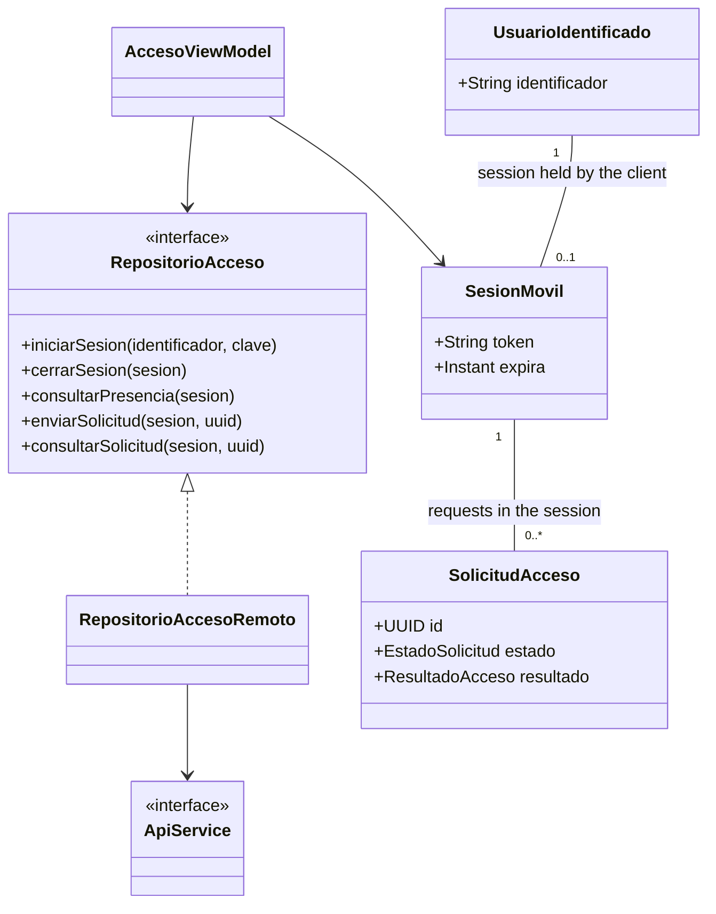

```mermaid
classDiagram
    direction TB

    class AccesoViewModel
    class RepositorioAcceso {
        <<interface>>
        +iniciarSesion(identificador, clave)
        +cerrarSesion(sesion)
        +consultarPresencia(sesion)
        +enviarSolicitud(sesion, uuid)
        +consultarSolicitud(sesion, uuid)
    }
    class RepositorioAccesoRemoto
    class ApiService {
        <<interface>>
    }
    class UsuarioIdentificado {
        +String identificador
    }
    class SesionMovil {
        +String token
        +Instant expira
    }
    class SolicitudAcceso {
        +UUID id
        +EstadoSolicitud estado
        +ResultadoAcceso resultado
    }

    AccesoViewModel --> RepositorioAcceso
    AccesoViewModel --> SesionMovil
    RepositorioAcceso <|.. RepositorioAccesoRemoto
    RepositorioAccesoRemoto --> ApiService
    UsuarioIdentificado "1" -- "0..1" SesionMovil : session held by the client
    SesionMovil "1" -- "0..*" SolicitudAcceso : requests in the session
```