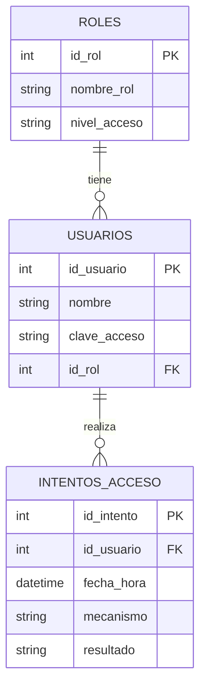

```mermaid
erDiagram
    ROLES ||--o{ USUARIOS : "tiene"
    USUARIOS ||--o{ INTENTOS_ACCESO : "realiza"

    ROLES {
        int id_rol PK
        string nombre_rol
        string nivel_acceso
    }

    USUARIOS {
        int id_usuario PK
        string nombre
        string clave_acceso
        int id_rol FK
    }

    INTENTOS_ACCESO {
        int id_intento PK
        int id_usuario FK
        datetime fecha_hora
        string mecanismo
        string resultado
    }
```