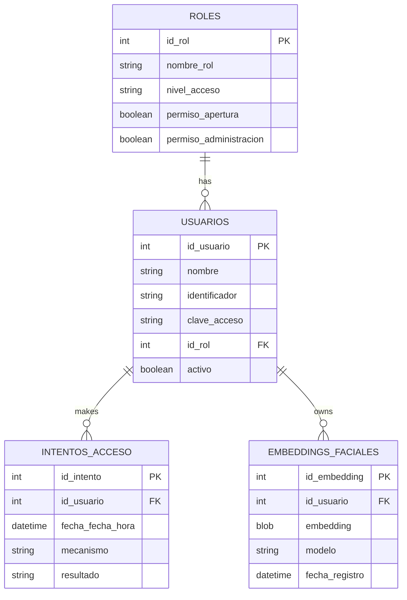

```mermaid
erDiagram
    ROLES ||--o{ USUARIOS : "has"
    USUARIOS ||--o{ INTENTOS_ACCESO : "makes"
    USUARIOS ||--o{ EMBEDDINGS_FACIALES : "owns"

    ROLES {
        int id_rol PK
        string nombre_rol
        string nivel_acceso
        boolean permiso_apertura
        boolean permiso_administracion
    }

    USUARIOS {
        int id_usuario PK
        string nombre
        string identificador
        string clave_acceso
        int id_rol FK
        boolean activo
    }

    INTENTOS_ACCESO {
        int id_intento PK
        int id_usuario FK
        datetime fecha_fecha_hora
        string mecanismo
        string resultado
    }

    EMBEDDINGS_FACIALES {
        int id_embedding PK
        int id_usuario FK
        blob embedding
        string modelo
        datetime fecha_registro
    }
```