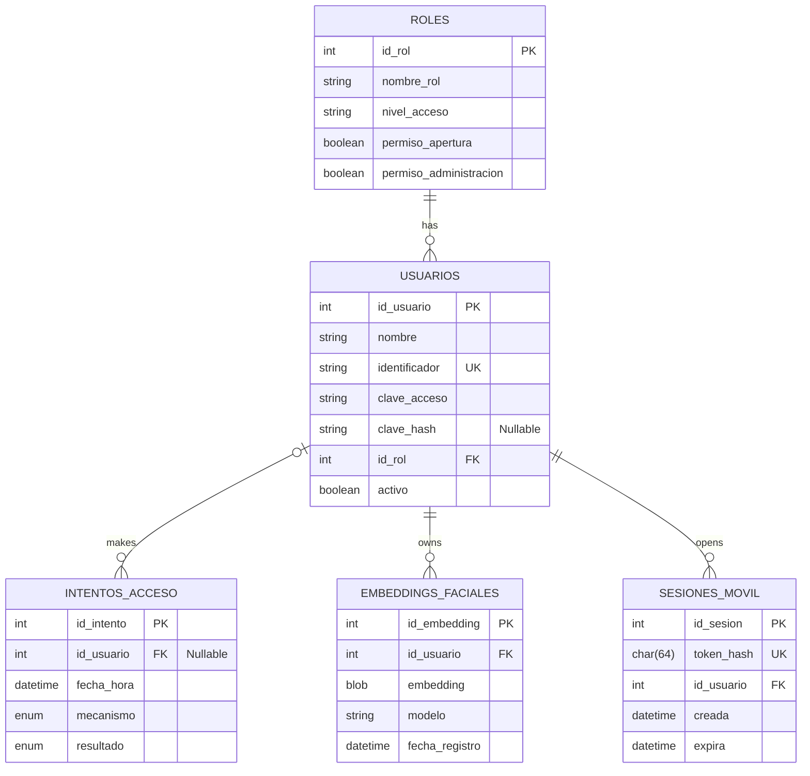

```mermaid
erDiagram
    ROLES ||--o{ USUARIOS : "has"
    USUARIOS |o--o{ INTENTOS_ACCESO : "makes"
    USUARIOS ||--o{ EMBEDDINGS_FACIALES : "owns"
    USUARIOS ||--o{ SESIONES_MOVIL : "opens"

    ROLES {
        int id_rol PK
        string nombre_rol
        string nivel_acceso
        boolean permiso_apertura
        boolean permiso_administracion
    }

    USUARIOS {
        int id_usuario PK
        string nombre
        string identificador UK
        string clave_acceso
        string clave_hash "Nullable"
        int id_rol FK
        boolean activo
    }

    INTENTOS_ACCESO {
        int id_intento PK
        int id_usuario FK "Nullable"
        datetime fecha_hora
        enum mecanismo
        enum resultado
    }

    EMBEDDINGS_FACIALES {
        int id_embedding PK
        int id_usuario FK
        blob embedding
        string modelo
        datetime fecha_registro
    }

    SESIONES_MOVIL {
        int id_sesion PK
        char(64) token_hash UK
        int id_usuario FK
        datetime creada
        datetime expira
    }
```