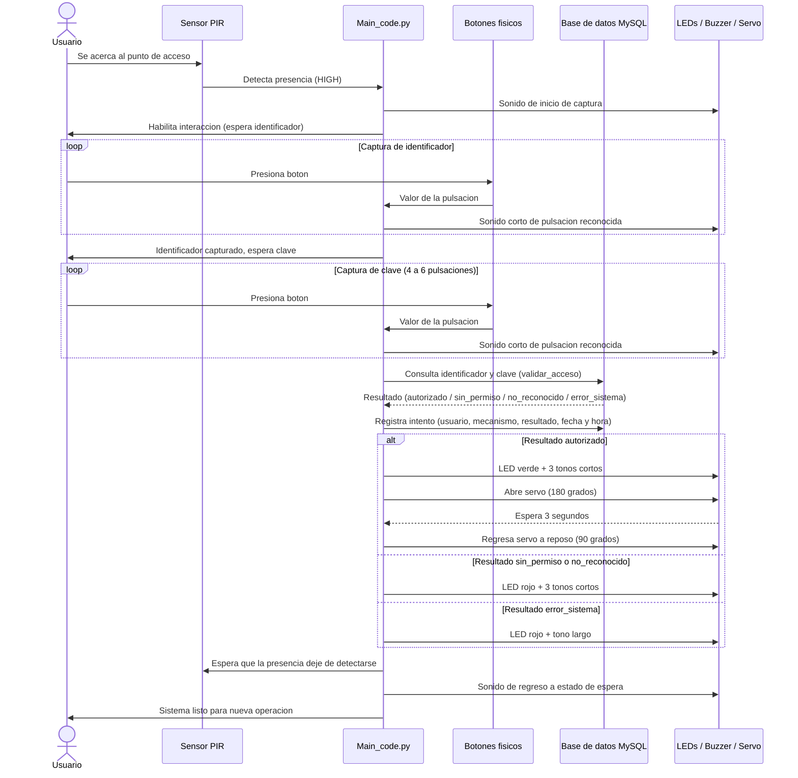

```mermaid
sequenceDiagram
    actor Usuario
    participant PIR as Sensor PIR
    participant Sistema as Main_code.py
    participant Botones as Botones fisicos
    participant BD as Base de datos MySQL
    participant Indicadores as LEDs / Buzzer / Servo

    Usuario->>PIR: Se acerca al punto de acceso
    PIR->>Sistema: Detecta presencia (HIGH)
    Sistema->>Indicadores: Sonido de inicio de captura
    Sistema->>Usuario: Habilita interaccion (espera identificador)

    loop Captura de identificador
        Usuario->>Botones: Presiona boton
        Botones->>Sistema: Valor de la pulsacion
        Sistema->>Indicadores: Sonido corto de pulsacion reconocida
    end

    Sistema->>Usuario: Identificador capturado, espera clave

    loop Captura de clave (4 a 6 pulsaciones)
        Usuario->>Botones: Presiona boton
        Botones->>Sistema: Valor de la pulsacion
        Sistema->>Indicadores: Sonido corto de pulsacion reconocida
    end

    Sistema->>BD: Consulta identificador y clave (validar_acceso)
    BD-->>Sistema: Resultado (autorizado / sin_permiso / no_reconocido / error_sistema)
    Sistema->>BD: Registra intento (usuario, mecanismo, resultado, fecha y hora)

    alt Resultado autorizado
        Sistema->>Indicadores: LED verde + 3 tonos cortos
        Sistema->>Indicadores: Abre servo (180 grados)
        Indicadores-->>Sistema: Espera 3 segundos
        Sistema->>Indicadores: Regresa servo a reposo (90 grados)
    else Resultado sin_permiso o no_reconocido
        Sistema->>Indicadores: LED rojo + 3 tonos cortos
    else Resultado error_sistema
        Sistema->>Indicadores: LED rojo + tono largo
    end

    Sistema->>PIR: Espera que la presencia deje de detectarse
    Sistema->>Indicadores: Sonido de regreso a estado de espera
    Sistema->>Usuario: Sistema listo para nueva operacion
```