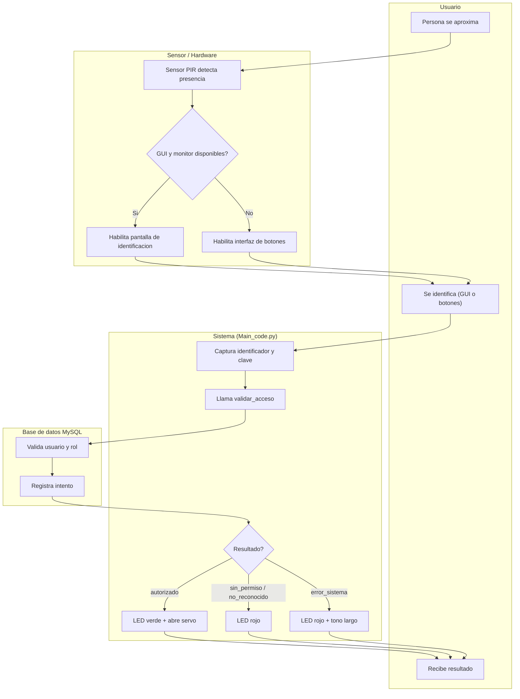

```mermaid
flowchart TD
    subgraph USR["Usuario"]
        A["Persona se aproxima"]
        F["Se identifica (GUI o botones)"]
        H["Recibe resultado"]
    end

    subgraph HW["Sensor / Hardware"]
        B["Sensor PIR detecta presencia"]
        C{"GUI y monitor disponibles?"}
        D["Habilita pantalla de identificacion"]
        E["Habilita interfaz de botones"]
    end

    subgraph SIS["Sistema (Main_code.py)"]
        G["Captura identificador y clave"]
        I["Llama validar_acceso"]
        J{"Resultado?"}
        K["LED verde + abre servo"]
        L["LED rojo"]
        M["LED rojo + tono largo"]
    end

    subgraph BD["Base de datos MySQL"]
        N["Valida usuario y rol"]
        O["Registra intento"]
    end

    A --> B
    B --> C
    C -- Si --> D
    C -- No --> E
    D --> F
    E --> F
    F --> G
    G --> I
    I --> N
    N --> O
    O --> J
    J -- autorizado --> K
    J -- sin_permiso / no_reconocido --> L
    J -- error_sistema --> M
    K --> H
    L --> H
    M --> H
```