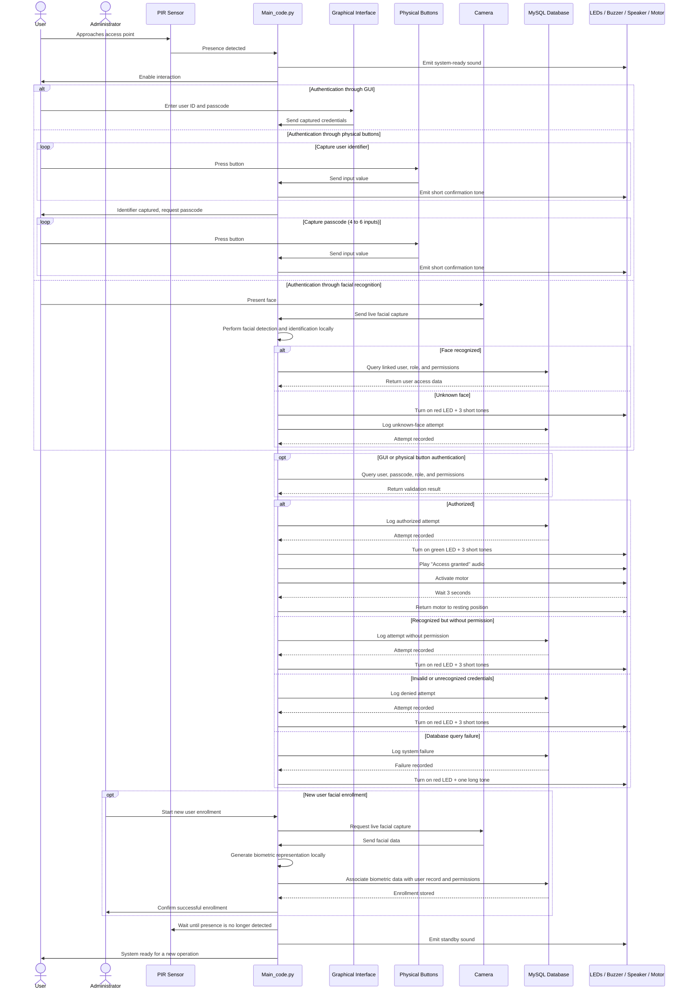

```mermaid
sequenceDiagram
    actor User
    actor Admin as Administrator
    participant PIR as PIR Sensor
    participant System as Main_code.py
    participant GUI as Graphical Interface
    participant Buttons as Physical Buttons
    participant Camera as Camera
    participant DB as MySQL Database
    participant Indicators as LEDs / Buzzer / Speaker / Motor
    User->>PIR: Approaches access point
    PIR->>System: Presence detected
    System->>Indicators: Emit system-ready sound
    System->>User: Enable interaction
    alt Authentication through GUI
        User->>GUI: Enter user ID and passcode
        GUI->>System: Send captured credentials

    else Authentication through physical buttons
        loop Capture user identifier
            User->>Buttons: Press button
            Buttons->>System: Send input value
            System->>Indicators: Emit short confirmation tone
        end

        System->>User: Identifier captured, request passcode

        loop Capture passcode (4 to 6 inputs)
            User->>Buttons: Press button
            Buttons->>System: Send input value
            System->>Indicators: Emit short confirmation tone
        end

    else Authentication through facial recognition
        User->>Camera: Present face
        Camera->>System: Send live facial capture
        System->>System: Perform facial detection and identification locally

        alt Face recognized
            System->>DB: Query linked user, role, and permissions
            DB-->>System: Return user access data
        else Unknown face
            System->>Indicators: Turn on red LED + 3 short tones
            System->>DB: Log unknown-face attempt
            DB-->>System: Attempt recorded
        end
    end
    opt GUI or physical button authentication
        System->>DB: Query user, passcode, role, and permissions
        DB-->>System: Return validation result
    end
    alt Authorized
        System->>DB: Log authorized attempt
        DB-->>System: Attempt recorded
        System->>Indicators: Turn on green LED + 3 short tones
        System->>Indicators: Play "Access granted" audio
        System->>Indicators: Activate motor
        Indicators-->>System: Wait 3 seconds
        System->>Indicators: Return motor to resting position

    else Recognized but without permission
        System->>DB: Log attempt without permission
        DB-->>System: Attempt recorded
        System->>Indicators: Turn on red LED + 3 short tones

    else Invalid or unrecognized credentials
        System->>DB: Log denied attempt
        DB-->>System: Attempt recorded
        System->>Indicators: Turn on red LED + 3 short tones

    else Database query failure
        System->>DB: Log system failure
        DB-->>System: Failure recorded
        System->>Indicators: Turn on red LED + one long tone
    end
    opt New user facial enrollment
        Admin->>System: Start new user enrollment
        System->>Camera: Request live facial capture
        Camera->>System: Send facial data
        System->>System: Generate biometric representation locally
        System->>DB: Associate biometric data with user record and permissions
        DB-->>System: Enrollment stored
        System->>Admin: Confirm successful enrollment
    end
    System->>PIR: Wait until presence is no longer detected
    System->>Indicators: Emit standby sound
    System->>User: System ready for a new operation
```