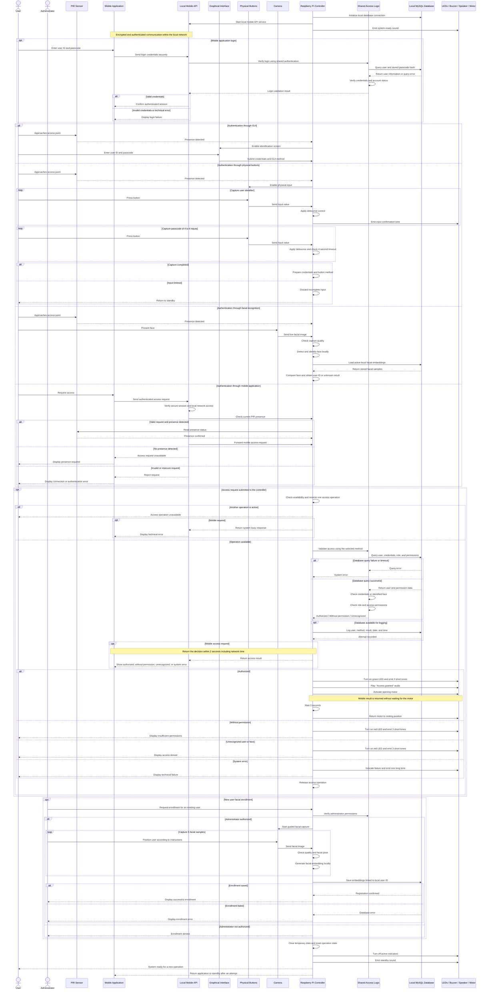

```mermaid
sequenceDiagram
    actor User
    actor Admin as Administrator
    participant PIR as PIR Sensor
    participant Mobile as Mobile Application
    participant API as Local Mobile API
    participant GUI as Graphical Interface
    participant Buttons as Physical Buttons
    participant Camera as Camera
    participant System as Raspberry Pi Controller
    participant Auth as Shared Access Logic
    participant DB as Local MySQL Database
    participant Indicators as LEDs / Buzzer / Speaker / Motor
    %% SYSTEM INITIALIZATION
    System->>DB: Initialize local database connection
    System->>API: Start local mobile API service
    System->>Indicators: Emit system-ready sound
    Note over Mobile,API: Encrypted and authenticated communication within the local network
    %% MOBILE LOGIN
    opt Mobile application login
        User->>Mobile: Enter user ID and passcode
        Mobile->>API: Send login credentials securely
        API->>Auth: Verify login using shared authentication
        Auth->>DB: Query user and stored passcode hash
        DB-->>Auth: Return user information or query error
        Auth->>Auth: Verify credentials and account status
        Auth-->>API: Login validation result
        alt Valid credentials
            API-->>Mobile: Confirm authenticated session
        else Invalid credentials or technical error
            API-->>Mobile: Display login failure
        end
    end
    %% ACCESS METHOD
    alt Authentication through GUI
        User->>PIR: Approaches access point
        PIR-->>System: Presence detected
        System->>GUI: Enable identification screen
        User->>GUI: Enter user ID and passcode
        GUI->>System: Submit credentials and GUI method
    else Authentication through physical buttons
        User->>PIR: Approaches access point
        PIR-->>System: Presence detected
        System->>Buttons: Enable physical input
        loop Capture user identifier
            User->>Buttons: Press button
            Buttons->>System: Send input value
            System->>System: Apply debounce control
            System->>Indicators: Emit input confirmation tone
        end
        loop Capture passcode of 4 to 6 inputs
            User->>Buttons: Press button
            Buttons->>System: Send input value
            System->>System: Apply debounce and check 4-second timeout
        end
        alt Capture completed
            System->>System: Prepare credentials and button method
        else Input timeout
            System->>System: Discard incomplete input
            System-->>User: Return to standby
        end
    else Authentication through facial recognition
        User->>PIR: Approaches access point
        PIR-->>System: Presence detected
        User->>Camera: Present face
        Camera->>System: Send live facial image
        System->>System: Check capture quality
        System->>System: Detect and identify face locally
        System->>DB: Load active local facial embeddings
        DB-->>System: Return stored facial samples
        System->>System: Compare face and obtain user ID or unknown result
    else Authentication through mobile application
        User->>Mobile: Request access
        Mobile->>API: Send authenticated access request
        API->>API: Verify secure session and local network access
        API->>System: Check current PIR presence
        alt Valid request and presence detected
            System->>PIR: Read presence status
            PIR-->>System: Presence confirmed
            API->>System: Forward mobile access request
        else No presence detected
            API-->>Mobile: Access request unavailable
            Mobile-->>User: Display presence required
        else Invalid or insecure request
            API-->>Mobile: Reject request
            Mobile-->>User: Display connection or authentication error
        end
    end
    %% SHARED ACCESS VALIDATION
    opt Access request submitted to the controller
        System->>System: Check availability and reserve one access operation
        alt Another operation is active
            System-->>User: Access operation unavailable
            opt Mobile request
                System-->>API: Return system busy response
                API-->>Mobile: Display technical error
            end
        else Operation available
            System->>Auth: Validate access using the selected method
            Auth->>DB: Query user, credentials, role, and permissions
            alt Database query failure or timeout
                DB-->>Auth: Query error
                Auth-->>System: System error
            else Database query successful
                DB-->>Auth: Return user and permission data
                Auth->>Auth: Check credentials or identified face
                Auth->>Auth: Check role and access permissions
                Auth-->>System: Authorized / Without permission / Unrecognized
            end
            opt Database available for logging
                System->>DB: Log user, method, result, date, and time
                DB-->>System: Attempt recorded
            end
            %% MOBILE RESPONSE
            opt Mobile access request
                Note over System,Mobile: Return the decision within 2 seconds including network time
                System-->>API: Return access result
                API-->>Mobile: Show authorized, without permission, unrecognized, or system error
            end
            %% PHYSICAL OUTPUTS
            alt Authorized
                System->>Indicators: Turn on green LED and emit 3 short tones
                System->>Indicators: Play "Access granted" audio
                System->>Indicators: Activate opening motor
                Note over System,Indicators: Mobile result is returned without waiting for the motor
                System->>System: Wait 3 seconds
                System->>Indicators: Return motor to resting position

            else Without permission
                System->>Indicators: Turn on red LED and emit 3 short tones
                System-->>User: Display insufficient permissions

            else Unrecognized user or face
                System->>Indicators: Turn on red LED and emit 3 short tones
                System-->>User: Display access denied

            else System error
                System->>Indicators: Indicate failure and emit one long tone
                System-->>User: Display technical failure
            end
            System->>System: Release access operation
        end
    end
    %% FACIAL ENROLLMENT
    opt New user facial enrollment
        Admin->>System: Request enrollment for an existing user
        System->>Auth: Verify administrator permissions
        alt Administrator authorized
            System->>Camera: Start guided facial capture
            loop Capture 5 facial samples
                Admin->>Camera: Position user according to instructions
                Camera->>System: Send facial image
                System->>System: Check quality and facial pose
                System->>System: Generate facial embedding locally
            end
            System->>DB: Save embeddings linked to local user ID
            alt Enrollment saved
                DB-->>System: Registration confirmed
                System-->>Admin: Display successful enrollment
            else Enrollment failed
                DB-->>System: Database error
                System-->>Admin: Display enrollment error
            end
        else Administrator not authorized
            System-->>Admin: Enrollment denied
        end
    end
    %% RETURN TO STANDBY
    System->>System: Clear temporary data and reset operation state
    System->>Indicators: Turn off active indicators
    System->>Indicators: Emit standby sound
    System-->>User: System ready for a new operation
    System-->>Mobile: Return application to standby after an attempt
```